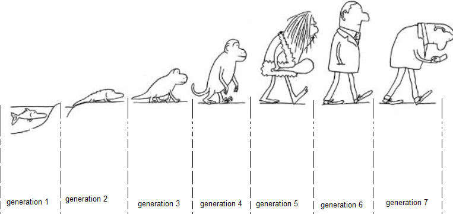
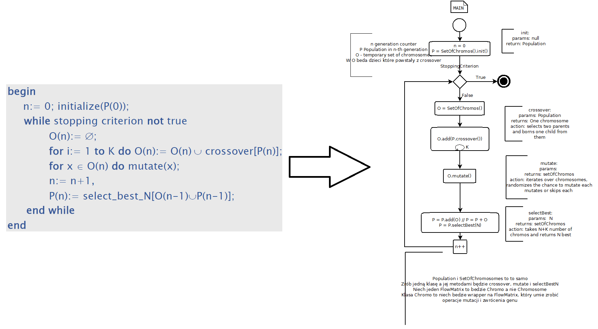

# oast-proj

This repository contains solution to the "DDAP/DAP solved with evolutionary algorithm" project of the course "OAST - Optimization and Analysis of ICT networks" realized during the winter semester of 2022 on the Warsaw University of Technology.

## The problem and the method to solve it

DAP - Demand and Allocation Problem.

DDAP - Dimensioning and Demand Allocation Problem

A description of the problems themselves can be found in [notebook PL version only](docs/zeszyt/zeszyt.md).

Project subject was to use Evolutionary Algorithm to solve these problems with the given network.

## Solution architecture

Solution was nicely documented in [docs/stage 2 - ea](docs/stage 2 - ea) directory.

Documentation contains:

- BPMN diagram of the algorithm flow

- UML Class diagram of the code.

